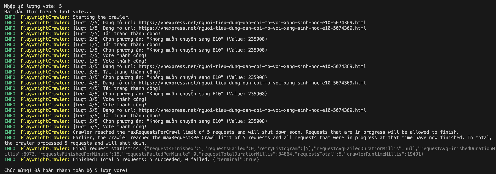

# Node Simple TypeScript - VnExpress Auto-Vote Tool

Dự án này là một công cụ tự động vote khảo sát trên VnExpress (ví dụ: khảo sát xăng sinh học E10) sử dụng **Crawlee** và **Playwright** chạy trên nền tảng **TypeScript**.

## Tính năng chính
- **Nhập số lượng động**: Khi khởi chạy, công cụ sẽ yêu cầu nhập số lượng lượt vote mong muốn từ terminal.
- **Xử lý song song tối ưu**: Tích hợp `maxConcurrency` để chạy song song nhiều browser instance (mặc định là 2), giúp tối đa tốc độ mà không gây đơ/treo máy.
- **Môi trường sạch (Session Isolated)**: Mỗi lượt vote được Crawlee khởi tạo một trình duyệt ẩn danh riêng biệt (Isolated Browser Context), tự động dọn sạch Cookie/Local Storage giữa các lượt.
- **Tránh trùng lặp URL**: Sử dụng cơ chế `uniqueKey` động để Crawlee xử lý cùng một link bài viết nhiều lần.

## Yêu cầu hệ thống
- **Node.js**: Phiên bản `16+` (khuyến nghị `node@22`).
- **npm**: Quản lý gói thư viện đi kèm.

## Hướng dẫn cài đặt

1. Cài đặt các thư viện dependencies:
   ```bash
   npm install
   ```
   *(Trình duyệt Playwright sẽ tự động được cài đặt sau khi chạy npm install nhờ hook `postinstall`).*

2. Hoặc nếu bạn muốn cài đặt thủ công trình duyệt cho Playwright:
   ```bash
   npx playwright install
   ```

## Hướng dẫn sử dụng

1. Chạy dự án ở chế độ phát triển:
   ```bash
   npm run dev
   ```
2. Nhập số lượng vote mong muốn và nhấn **Enter**:
   ```text
   Nhập số lượng vote: 10
   Bắt đầu thực hiện 10 lượt vote...
   ```
3. Xem logs tiến trình thực thi trực tiếp trên màn hình terminal cho đến khi hoàn thành toàn bộ.

## Công cụ & Định dạng mã nguồn
- Đã cấu hình sẵn `Prettier`, `ESLint`, `.editorconfig` giúp chuẩn hóa mã nguồn.
- Tự động format code bằng cách chạy:
  ```bash
  npm run format
  ```

## Screenshot



## Tác giả
- tanmv — <macvantan@gmail.com>
